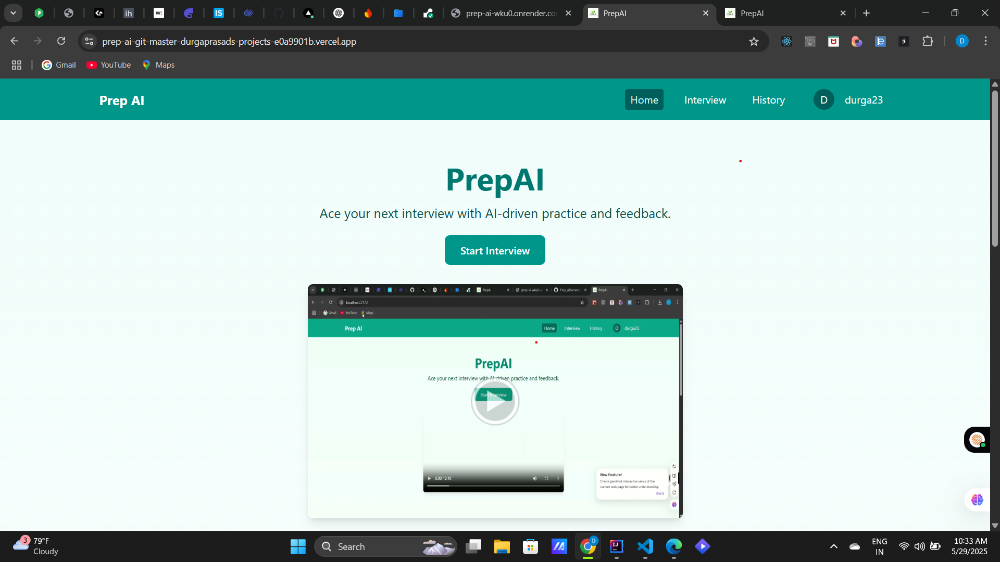
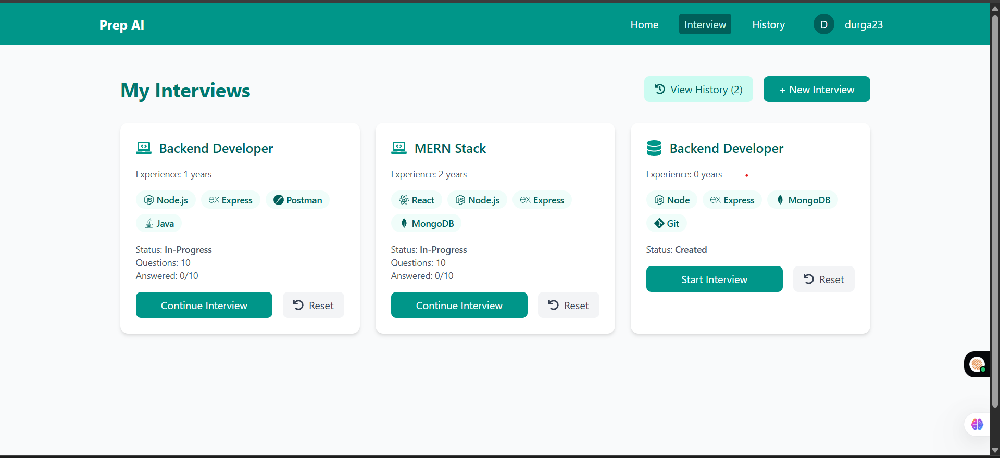
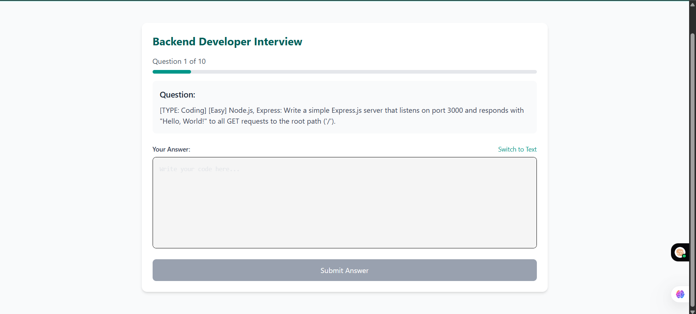
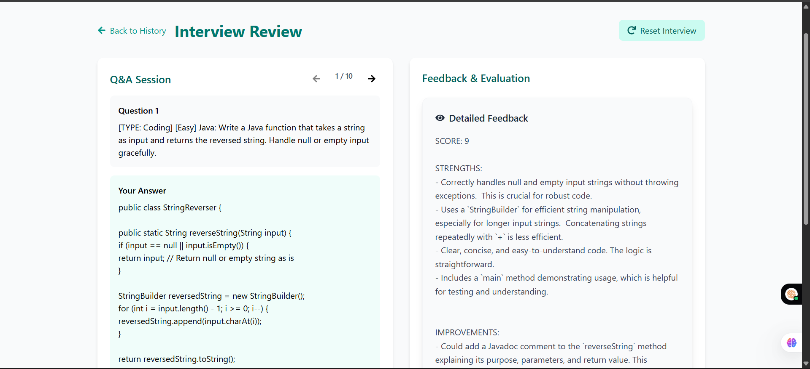
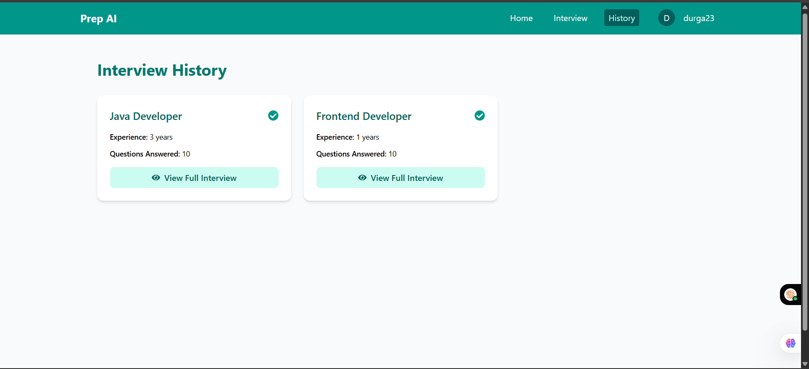

# 🚀 Prep-AI – Your AI-Powered Interview Preparation Companion

Prep-AI is a full-stack web application designed to help candidates prepare for interviews based on selected roles. It leverages AI to generate tailored questions—both theoretical and coding—and provides a seamless and interactive user experience.

🚀 🌐 [Frontend (Vercel)](https://prep-ai-git-master-durgaprasads-projects-e0a9901b.vercel.app/) | 🔧 [Backend (Render)](https://prep-ai-wku0.onrender.com)


---

## 📚 Table of Contents

* [📝 Introduction](#introduction)
* [📸 Screenshots](#screenshots)
* [🧰 Tech Stack](#tech-stack)
* [✨ Features](#features)
* [⚙️ Installation](#installation)
* [🚀 Usage](#usage)
* [📡 API Documentation](#api-documentation)
* [🔐 Environment Variables](#environment-variables)
* [🤝 Contributing](#contributing)
* [📄 License](#license)
* [📬 Contact](#contact)

---

## 📝 Introduction

Prep-AI empowers users to:

* 🎯 Select interview roles and generate personalized interview sets.
* 🤖 Leverage AI to generate theoretical and coding questions.
* 📁 Store interview sessions and revisit them later for revision.
* 🔒 Secure user authentication with Firebase.

---

## 📸 Screenshots

### Homepage


### Interview


### AI-Interviews


### Feedbacks


### History



## 🧰 Tech Stack

### 🌐 Frontend (`client`)

* **Framework**: React with Vite
* **Styling**: Tailwind CSS
* **Routing**: React Router DOM
* **Forms**: React Hook Form
* **State & Animation**: Framer Motion, React Hot Toast, Toastify
* **Code UI**: `@uiw/react-textarea-code-editor`, `react-syntax-highlighter`
* **Auth & Speech**: Firebase, Speechly
* **Helmet**: React Helmet Async

### 🛠️ Backend (`server`)

* **Runtime**: Node.js (CommonJS)
* **Framework**: Express
* **Security**: JWT, bcryptjs
* **AI Integration**: Google Generative AI
* **Database**: Firebase Admin SDK
* **Utilities**: dotenv, uuid, cors, nodemon

---

## ✨ Features

* 🔐 User Authentication with Firebase
* 🧠 Role-based AI question generation
* 📑 Coding editor and syntax highlighting
* 🧾 Save & revisit past interviews
* ⚙️ Real-time toast and notifications

---

## ⚙️ Installation

### Prerequisites

* Node.js (v18+)
* Firebase project setup
* Google Generative AI API Key

### 1️⃣ Clone the repository

```bash
git clone https://github.com/your-username/prep-ai.git
cd prep-ai
```

### 2️⃣ Setup the client

```bash
cd client
npm install
npm run dev
```

### 3️⃣ Setup the server

```bash
cd server
npm install
nodemon index.js
```

---

## 🚀 Usage

* Visit `http://localhost:5173` to use the app.
* Choose a role, and start your AI-generated interview session.
* Practice theory + coding questions in the built-in editor.
* Login to save your sessions and revisit them anytime.

---

## 📡 API Documentation

### Base URL

```
http://localhost:8080/api
```

### Routes

* `POST /auth/signup` – Sign UP a new user
* `POST /auth/login` – Login and receive JWT
* `GET /interview/:role` – Get AI-generated questions
* `POST /interview/save` – Save user session

> *More route documentation coming soon.*

---

## 🔐 Environment Variables

### Frontend (`client/.env`)

```env
VITE_FIREBASE_API_KEY=your_firebase_key
VITE_FIREBASE_AUTH_DOMAIN=your_project.firebaseapp.com
VITE_FIREBASE_PROJECT_ID=your_project_id
VITE_FIREBASE_STORAGE_BUCKET=your_project.appspot.com
VITE_FIREBASE_MESSAGING_SENDER_ID=...
VITE_FIREBASE_APP_ID=...
VITE_GOOGLE_GENERATIVE_AI_API_KEY=...
```

### Backend (`server/.env`)

```env
PORT=5000
FIREBASE_PROJECT_ID=...
FIREBASE_PRIVATE_KEY_ID=...
FIREBASE_PRIVATE_KEY=...
FIREBASE_CLIENT_EMAIL=...
JWT_SECRET=your_jwt_secret
GOOGLE_API_KEY=your_google_gemini_api_key
```

---

## 🤝 Contributing

Contributions are welcome! Please follow these steps:

1. Fork the repository
2. Create a new branch (`git checkout -b feature/your-feature`)
3. Commit your changes (`git commit -m 'Add new feature'`)
4. Push to the branch (`git push origin feature/your-feature`)
5. Open a Pull Request

---

## 📄 License

This project is licensed under the [MIT License](LICENSE).

---

## 📬 Contact

* **Author**: Durga Prasad
* **GitHub**: [Durga1534](https://github.com/Durga1534)
* **Email**: [kondurudurgaprasad.2@gmailcom](mailto:kondurudurgaprasad.2@gmail.com)
