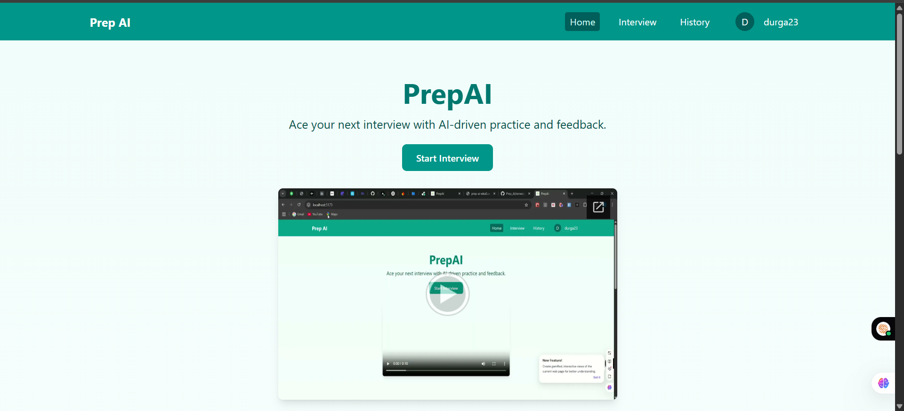

# 🚀 Prep-AI – Your AI-Powered Interview Preparation Companion

Prep-AI is a full-stack web application designed to help candidates prepare for interviews based on selected roles. It leverages AI to generate tailored theoretical and coding questions and provides a seamless, interactive user experience.

🌐 [Live Demo – Frontend (Vercel)](https://prep-ai-git-master-durgaprasads-projects-e0a9901b.vercel.app/)  
🔧 [Backend (Render)](https://prep-ai-wku0.onrender.com)

---

## 📚 Table of Contents

- [📝 Introduction](#-introduction)
- [📸 Screenshots](#-screenshots)
- [🧰 Tech Stack](#-tech-stack)
- [✨ Features](#-features)
- [🔧 Work In Progress](#-work-in-progress)
- [⚙️ Installation](#️-installation)
- [🚀 Usage](#-usage)
- [📡 API Documentation](#-api-documentation)
- [🔐 Environment Variables](#-environment-variables)
- [🤝 Contributing](#-contributing)
- [📄 License](#-license)
- [📬 Contact](#-contact)

---

## 📝 Introduction

Prep-AI empowers users to:

- 🎯 Select interview roles and generate personalized question sets.
- 🤖 Use AI (Gemini) for dynamic theoretical and coding question generation.
- 📁 Save and revisit interview sessions.
- 🔐 Ensure secure authentication using Firebase.

---

## 📸 Screenshots


| Homepage | AI Interview | Interview History |
|---------|--------------|-------------------|
|  |  |  |

| Interview Page | Feedback |
|----------------|----------|
|  |  |

---

## 🧰 Tech Stack

### 🌐 Frontend (`client`)

- **Framework**: React + Vite
- **Styling**: Tailwind CSS
- **Routing**: React Router DOM
- **Forms**: React Hook Form
- **UI/UX**: Framer Motion, React Toastify, Hot Toast
- **Editor & Highlighting**: `@uiw/react-textarea-code-editor`, `react-syntax-highlighter`
- **Authentication**: Firebase Auth
- **SEO**: React Helmet Async

### 🛠️ Backend (`server`)

- **Runtime**: Node.js
- **Framework**: Express
- **Security**: JWT Auth
- **Database**: Firebase Admin SDK (Firestore)
- **AI Integration**: Google Generative AI (Gemini)
- **Tools**: dotenv, uuid, cors, nodemon

---

## ✨ Features

- 🔐 Firebase-based user authentication
- 🎓 Role-based interview session generator
- 🧠 AI-generated coding + theoretical questions
- 💾 Interview session saving & revisiting
- 📤 Instant feedback integration
- 📋 Clean code editor with syntax highlighting

---

## 🔧 Work In Progress

Features completed ✅ and those coming soon 🚧:

- [x] **AI-Generated Questions using Gemini**  
  Dynamically tailored theory + coding questions by experience and role.

- [x] **Firebase Auth + Firestore Storage**  
  Secure login, signup, and session data storage.

- [ ] **📊 Progress Dashboard with Charts**  
  Visual analytics on topics covered, sessions attempted, success rate, etc.

- [ ] **🧑‍💻 Code Editor for Solving Coding Questions**  
  Advanced editor (Monaco/CodeMirror) with runtime evaluation coming soon.

- [ ] **⭐ Bookmark / Star Questions**  
  Save favorite questions for review later.

- [ ] **🛠️ Admin Panel for Content Management**  
  Manage users, feedback, and question categories via a secure admin interface.

---

## ⚙️ Installation

### Prerequisites

- Node.js v18+
- Firebase Project
- Google Gemini API Key

### Clone the repo

```bash
git clone https://github.com/Durga1534/prep-ai.git
cd prep-ai


### 2️⃣ Setup the client

```bash
cd client
npm install
npm run dev
```

### 3️⃣ Setup the server

```bash
cd server
npm install
nodemon index.js
```

---

## 🚀 Usage

* Visit `http://localhost:5173` to use the app.
* Choose a role, and start your AI-generated interview session.
* Practice theory + coding questions in the built-in editor.
* Login to save your sessions and revisit them anytime.

---

## 📡 API Documentation

### Base URL

```
http://localhost:8080/api
```

### Routes

* `POST /auth/signup` – Sign UP a new user
* `POST /auth/login` – Login and receive JWT
* `GET /interview/:role` – Get AI-generated questions
* `POST /interview/save` – Save user session

> *More route documentation coming soon.*

---

## 🔐 Environment Variables

### Frontend (`client/.env`)

```env
VITE_FIREBASE_API_KEY=your_firebase_key
VITE_FIREBASE_AUTH_DOMAIN=your_project.firebaseapp.com
VITE_FIREBASE_PROJECT_ID=your_project_id
VITE_FIREBASE_STORAGE_BUCKET=your_project.appspot.com
VITE_FIREBASE_MESSAGING_SENDER_ID=...
VITE_FIREBASE_APP_ID=...
VITE_GOOGLE_GENERATIVE_AI_API_KEY=...
```

### Backend (`server/.env`)

```env
PORT=5000
FIREBASE_PROJECT_ID=...
FIREBASE_PRIVATE_KEY_ID=...
FIREBASE_PRIVATE_KEY=...
FIREBASE_CLIENT_EMAIL=...
JWT_SECRET=your_jwt_secret
GOOGLE_API_KEY=your_google_gemini_api_key
```

---

## 🤝 Contributing

Contributions are welcome! Please follow these steps:

1. Fork the repository
2. Create a new branch (`git checkout -b feature/your-feature`)
3. Commit your changes (`git commit -m 'Add new feature'`)
4. Push to the branch (`git push origin feature/your-feature`)
5. Open a Pull Request

---

## 📄 License

This project is licensed under the [MIT License](LICENSE).

---

## 📬 Contact

* **Author**: Durga Prasad
* **GitHub**: [Durga1534](https://github.com/Durga1534)
* **Email**: [kondurudurgaprasad.2@gmailcom](mailto:kondurudurgaprasad.2@gmail.com)
